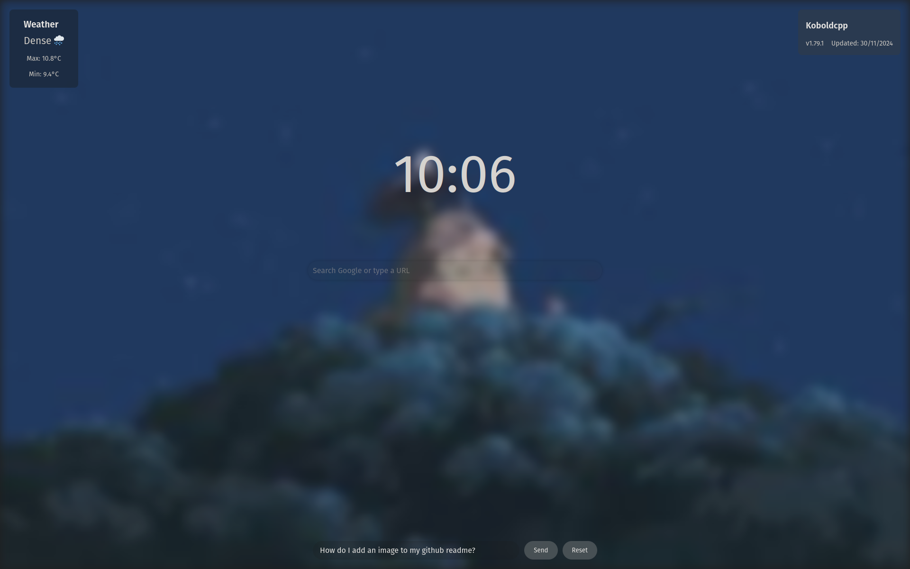

# AI Homepage
A landing page for your browser.

Weather, Time, Koboldcpp info shortcut, google search, and a mistral chat are all easily accessible. Made almost entirely by AI.

To change weather to Fahrenheit you'll have to mess with the open meteo API call, and to change the background change line 30. Change line 561 to add your Mistral API key, or find and replace key_here. To actually use the website download the index.html file and put it somewhere permanent, then in settings point your new tab page and home page to it. To change the repo you're getting updates for, you may or may not have to get jiggy with it, or maybe just change line 315.

/img does image gen through together.xyz (free), line 510 for API key. Maybe I should put the API keys in browser cache.

